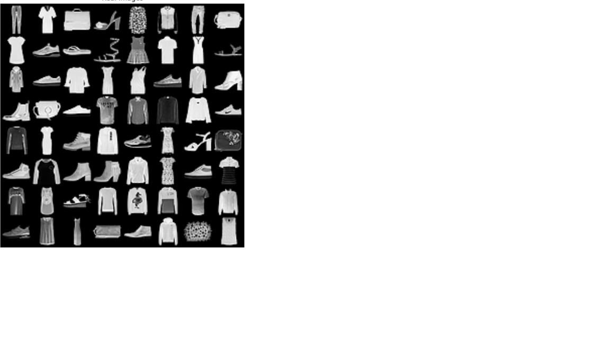
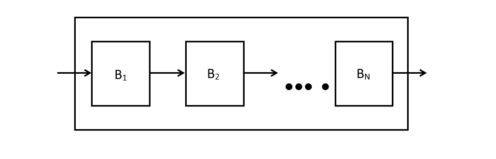

# ECS659U/P Coursework

# The problem :
1) Fashion-MNIST classification 
2) Classify every image in terms of 1 out of 10 classes 
3) Standard tasks for lectures and labs
4) Build a model on training set and evaluate on test 

# Overview of model
1) An architecture to process images based on MLPs.
2) Model architecture consists of Stem, backbone, classifier 

# The Stem
1) Takes as input an image <i>I</i> of size <i>H x W</i> and divides into Np non-overlapping patches.
2) Each patch Pi,j has <i>K x K</i> dimensions.
3) Each patch is vectorized, then transformed to a feature vector of dimesions <i>d: xi,j = f(pi,j)</i>
4) <i>f</i> can be a single layer or a single hidden layer MLP.
5) All features are stored in a matrix <i> X belongs R NpXd</i>

  
# The Backbone
1) Consists of <i>N</i> blocks. The basic implementation for each block Bi consists of two MLPs.
2) The first MLP is: O1 = g(X TW1)W2, where g is a non-linear activation function.
3) Next Step is O1 <- OT1
4) The second MLP is : O2 = g(O1W3)W4

# The Classifier
1) Takes as input the output O2 belongs to R NpXd0</i> of the last block <i>BN</i>
2) Then, it computes a mean feature <i>x belongs to R d0</i>
3) Finally, it feeds this feature to a classifier, can be softmax regression classifier.

